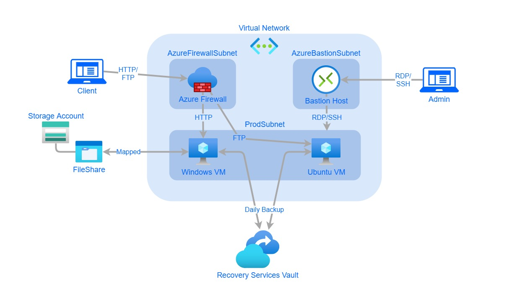
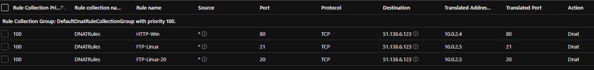
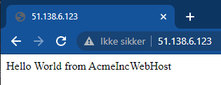
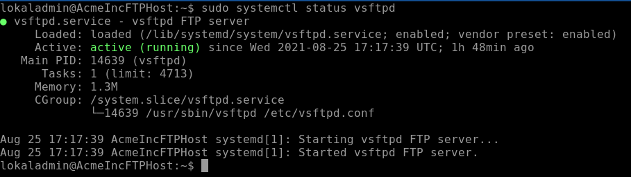
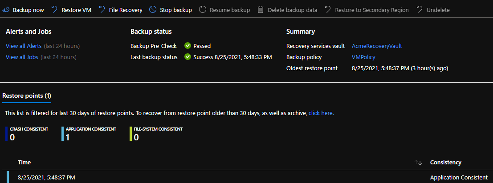
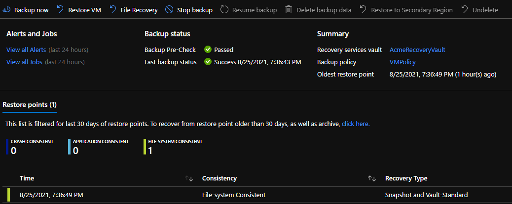
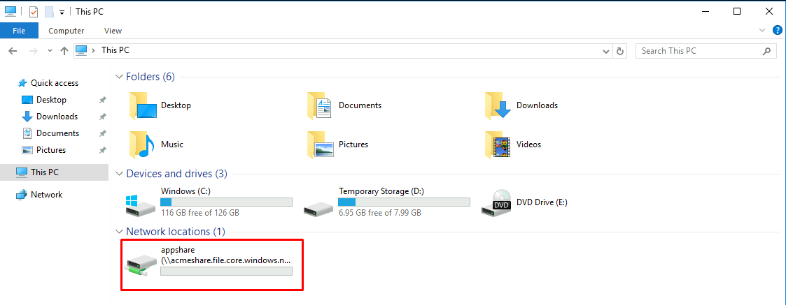

# Acme Inc Case Study

This is my solution to a Case Study in the AZ-104 course.

## Summary and diagram

To meet the requirements in the case description I created two virtual machines, one Windows Server and one Ubuntu Server.
I installed IIS on the Windows server with the custom scripts feature, and I installed an FTP dameon manually on the linux server. I decided to not create public IPs for the virtual machines as they were supposed to be accessed through a firewall or a jumpox/bastion host (i decided to create a bastion host). Both the Azure Firewall and the Bastion Host sits within their own subnet in the virtual network, and the virtual machines sit within another subnet. I configured DNAT rules in the firewall to allow ports 80, 20 and 21 through to the VMs. Port 80 is routed to the Windows VM and port 20 and 21 is routed to the Ubuntu VM. This means that users will go to the firewalls public IP to access the services (IE the website or the FTP dameon). To meet the backup requirements I created a recovery services vault and configured daily backup on the VMs. In addition I created a storage account for recovery staging. Finally I created a storage account for long term storage, within this I created a FileShare wich I mapped to the Windows Server. With these configurations my solution looks like this:

## Screenshots of the deployments

Below are a couple of screenshots of the deployment.

### The DNAT rules in the firewall policy:

### The website hosted on the Windows VM:

### The FTP service running on the Ubuntu VM:

### Backup of the Windows VM:

### Backup of the Ubuntu VM:

### The fileshare mapped on the Windows VM:

